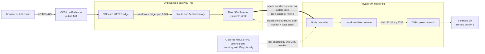

# Sparkbox on CoreWeave Kubernetes Service

This proof of concept splits Sparkbox across two trust domains: a non-root
public gateway and one capability-scoped Firecracker node pinned to a CKS
bare-metal CPU Node. A public CKS LoadBalancer provides SSH and wildcard HTTPS
routing under `coreweave.app`; the VM node has no public Service.

## The live deployment

One instance of this POC is running. Its `deploy.sh` flags are not recorded
anywhere in the cluster, so they are recorded here; pass them again on every
re-run.

| | |
|---|---|
| kubectl context | `cvp-hivemind-test-east-06_US-EAST-06A` |
| Namespace | `sparkbox-poc` |
| NodePool / pinned Node | `default-node-pool` / `g084f44` |
| Public domain | `catnip.sh` (`--proxy-domain`), DNS-only A records at the apex and wildcard |
| Allocated CKS domain | `sa932e-cvp-hivemind-test-east-06.coreweave.app`, still used for node approval |
| Operator | `vanpelt` |
| GitHub App (repo credentials) | `w-b-sparkbox` — App ID `4706326`, client id `Iv23li1tSkGgv8Mayb5D` (`--github-app-client-id`) |

The allocated `coreweave.app` wildcard keeps working alongside `catnip.sh`
because both resolve to the same LoadBalancer, but only the configured
`--proxy-domain` is used for published URLs, certificates, and WebAuthn origins.

The GitHub App above is **not** the one `--github-client-id` names for account
linking. They are deliberately separate: linking asks GitHub who somebody is and
requests no scope, while this one holds a private key and can mint repository
credentials. Its key reaches the gateway as `github_app_key.pem` in the
`sparkbox-identity` Secret, mounted read-only at `/run/sparkbox/keys` — there is
no path that copies a file onto this host, because the gateway Pod runs non-root
with a read-only root filesystem and port 22 is Sparkbox's own SSH gateway, which
has no sftp subsystem. See `docs/github-app-setup.md`.

### Template snapshots, and what they cost here

Template snapshots **work** on this cluster as of the change described in
[cks-snapshot-design.md](cks-snapshot-design.md). They did not before, and the
reason is worth keeping because it constrains what may be added next.

The node runs with `--disable-host-rootfs-mounts`, and it always will: the VM
controller container runs as uid 65532 with `capabilities: drop ALL` and cannot
call `mount(2)`, because putting the host kernel's ext4 driver in front of a
guest-authored filesystem would enlarge the trusted computing base past
Firecracker and KVM. `Driver.Snapshot` used to refuse outright under that flag.
It no longer does, because only one of its four steps ever needed a mount:

- `cp --reflink=always`, `e2fsck -fy` and `zerofree` all operate on the image
  file, and this cluster already runs them for checkpoints;
- `sanitizeTemplate` — six deletions of per-guest identity — is the one that
  mounted, and that work now happens inside the fork, at its first boot, before
  sshd (`sparkbox-identity-reset`, plus `systemd.machine_id=` on the kernel
  command line). It is still run at capture time on hosts where mounting is
  allowed, as defence in depth.

`installAuthorizedKey` keeps its guard: that is a real mount of a real guest
disk on the create path, and it stays off. **A consequence worth knowing before
rotating the gateway's upstream key: templates captured here carry whatever
gateway key their base image had, and nothing re-injects it on a fork.** A key
rotation invalidates every existing template.

Two limits that are not bugs but will bite:

- **Templates live on the node-local hot tier**, which CoreWeave reclaims with
  the Node. A template does not survive Node replacement and `snapshot create`
  does not say so.
- **Templates are unmetered and uncollected.** `admitCost` counts running
  sandboxes; a 25 GiB template is charged to nobody and swept by nothing but
  `snapshot rm`. See the deferred section of the design doc.

## What it creates

- Namespace `sparkbox-poc`.
- `sparkbox-gateway`, an unprivileged Deployment with no host devices,
  hostPath, Linux capabilities, or writable root filesystem.
- `sparkbox-node`, a Deployment pinned to one exact amd64 Node. Its application
  controller is non-root and capability-free; a narrow helper sidecar owns
  KVM/TUN and the remaining VM-launch capabilities.
- `sparkbox-device-plugin`, a capability-free DaemonSet that advertises one
  `sparkbox.dev/kvm`, `sparkbox.dev/tun`, and temporary `sparkbox.dev/loop`
  allocation per eligible Node.
- A Node-local XFS `hostPath` at `/mnt/local/sparkbox-poc` for the VM inventory,
  rootfs template, live sandbox disks, and node identity.
- A 100 GiB `shared-vast` PVC mounted at `/mnt/sparkbox-durable` for durable
  gateway databases, edge certificate cache, and checkpoint objects.
- Kubelet-managed device allocations for `/dev/kvm`, `/dev/net/tun`, and the
  loop-device bundle used by the one-shot trusted-template preparation init
  container. At runtime only the VMM helper receives KVM/TUN; the application
  controller receives no devices. There are no raw device `hostPath` volumes.
- A public `LoadBalancer` Service selecting only the gateway on SSH port 22,
  HTTP redirect port 80, HTTPS port 443, and common HTTPS development ports
  3000, 3001, 4000, 4200, 5000, 5173, 6006, 7860, 8000, 8080, 8443, 8501,
  8888, and 9000, plus an internal ClusterIP Service for the authenticated
  fleet link.
- Default-deny ingress, with only the gateway's SSH/fleet and HTTPS ports
  admitted. The node has no admitted ingress. A Cilium egress policy permits
  the VM node to reach only public IP space, cluster DNS, and the internal
  gateway fleet service.
- A Secret containing one operator's **public** SSH key.
- Optionally `sparkbox-github-webhook`, a Secret whose `secret` key holds the
  GitHub App's webhook secret. Absent, the gateway mounts no webhook receiver at
  all rather than one that would accept unverified deliveries, so leaving it out
  is a configuration state and not a failure. Create it with:

  ```sh
  kubectl -n sparkbox-poc create secret generic sparkbox-github-webhook \
    --from-literal=secret="$(openssl rand -hex 32)"
  ```

  then paste the same value into the App's Settings → Webhook → Secret. See
  `docs/github-webhooks.md`.
- A separately provisioned `sparkbox-identity` Secret containing the stable
  gateway, OIDC, and node-control identity, mounted only by the gateway. The
  node receives a separate Secret containing only the gateway's public host-key
  pin and public upstream login key.

## Gateway-to-VM traffic

The split CKS deployment currently uses an outbound, host-key-pinned SSH link
set from the VM node to the gateway: one control connection plus independently
supervised data lanes. The node is started with `--node-control-transport ssh`;
it does not publish a gRPC control endpoint. When the gateway needs guest TCP
port 6743, it opens a `sandbox-stream@sparkbox` channel carrying the sandbox
name, stream kind `tcp`, and port `6743` on a dedicated authenticated data lane.
The node resolves the sandbox from its local inventory and dials the guest's
TAP address at `HostIP:6743`.



The earlier gRPC work is separate from this stream path. It moves inventory
and lifecycle control off SSH and can advertise authoritative guest addresses.
With `--guest-data-transport auto` or `routed` and a real route to the guest
subnet, the gateway can then dial a roster-approved guest IP directly; gRPC
itself never tunnels the application bytes. This CKS manifest enables neither
the node gRPC endpoint nor that routed guest network, so SSH remains its guest
data plane.

There is also a public-edge distinction. Sparkbox can preserve an arbitrary
original destination port when the host firewall funnels an any-port range to
its HTTPS listener. The CKS LoadBalancer preloads several common development
ports, but does not expose 6743 by default. Configure the sandbox's HTTPS route
to target guest port 6743 and access it through public port 443. A direct
`https://<sandbox>.<domain>:6743` requires an additional LoadBalancer port or an
equivalent any-port funnel; merely listening on 6743 inside the VM does not
publish that port.

### Prototype non-default public HTTPS ports

`deploy/kubernetes/public-port.sh` updates the existing LoadBalancer Service
without granting Kubernetes credentials to the public gateway Pod. Each
managed public port targets the gateway's one named `https` port, so the same
listener still terminates TLS and enforces Sparkbox route authentication:

```sh
tools/sparkbox/deploy/kubernetes/public-port.sh add 6454
tools/sparkbox/deploy/kubernetes/public-port.sh list
```

Ports 3000, 3001, 4000, 4200, 5000, 5173, 6006, 7860, 8000, 8080, 8443,
8501, 8888, and 9000 are declared in `service.yaml` and therefore survive an
ordinary manifest re-apply. Port 80 feeds the gateway's cleartext-to-HTTPS
redirect. Use the helper for an additional experimental port such as 6454.
Port 8081 is intentionally absent: it is the gateway's internal listener and
is interpreted as the route's default rather than as guest port 8081.

After the load balancer finishes programming the change, both
`https://foo.<domain>:6454` and `https://bar.<domain>:6454` reach the gateway.
Sparkbox selects the sandbox from the hostname and selects guest port 6454
from the HTTP `Host`/HTTP2 `:authority` value. Configure each sandbox route to
target 6454 before testing it. Removal is deliberately explicit because one
Service port is shared by every hostname; verify that no route still uses the
port first:

```sh
tools/sparkbox/deploy/kubernetes/public-port.sh remove 6454
```

This is an operator-driven provider experiment, not yet an automatic route
reconciler. Confirm that changing the Service preserves the allocated public
address and existing connections before wiring route mutations to it.

Gateway API is useful for a more declarative L4/L7 frontend, but it does not
provide the missing L3 route from the gateway Pod to the VM-node guest prefix.
It also requires one numeric `Listener.port` per exposed port and limits a
Gateway to 64 listeners, so it does not express an all-port listener. A future
Gateway API version of this experiment would dynamically add TLS passthrough
listeners and continue terminating TLS in Sparkbox; guest-prefix routing remains
a separate Cilium or WireGuard concern.

The similarly common database ports 3306, 5432, 27017, and 6379 are not
included. The current gateway accepts HTTPS and forwards HTTP after terminating
TLS; it is not a generic MySQL, PostgreSQL, MongoDB, or Redis TCP proxy. Those
protocols also carry neither an HTTP hostname nor Sparkbox's browser session,
so publishing their ports would bypass the existing sandbox selection and
private-route authentication model. Raw TCP exposure needs a separate explicit
route type, protocol-appropriate identity, and an edge that leaves private
routes unpublished.

The Sparkbox controller runs as UID/GID 65532, drops every capability, receives
no devices, and uses `RuntimeDefault` seccomp/AppArmor. A separate root
`vmm-helper` container owns only the capabilities required for TAP/network
setup, chroot/device construction, file ownership, and terminating its per-VM
UID children. It is `privileged: false`, has no `CAP_SYS_ADMIN` or loop devices,
and exposes only a mode-0600 Unix socket authenticated with `SO_PEERCRED`. Its
path-free protocol accepts a validated VM name and network slot; paths,
executables, device numbers, and credentials are fixed at helper startup.
Firecracker runs in a per-VM chroot as `100000 + slot`, with an empty environment
and no capabilities. The one-shot preparation init container holds
`CAP_SYS_ADMIN` and the loop bundle only while patching the trusted base
template, then exits before guest work starts. The Pod does not use host PID,
network, IPC, or user namespaces. TAP devices, sysctls, NAT, and packet-filter
rules therefore live in the Pod's network namespace instead of modifying the
CKS Node's Cilium network namespace.

## Egress isolation and Sluice

CKS applies two independent egress boundaries to the VM node. The helper builds
stateful iptables chains inside the Pod network namespace before opening its
Unix socket. Each TAP is pinned to its slot-derived guest address, private and
non-global destinations are dropped, unsolicited forwarded traffic is dropped,
and a guest may initiate host traffic only to DNS and the authenticated metadata
service. The controller can still initiate SSH to a guest because established
reply traffic is admitted. Failure to install or verify these chains prevents
the helper from becoming ready.

After guest IPv4 traffic is masqueraded to the Pod address and leaves the Pod
veth, `vm-node-public-egress` supplies the outer Cilium boundary. Its positive
allow-list contains public IPv4/IPv6 space with private, loopback, link-local,
documentation, benchmark, multicast, and reserved ranges excluded. Separate
service-aware rules permit only CoreDNS on TCP/UDP 53 and
`sparkbox-gateway` on TCP 2222. This also prevents a compromised application
controller from using the Pod network to move laterally through the cluster or
CKS underlay.

The VM node also runs Sluice as a dedicated sidecar. It mounts only its Unix
control-socket `emptyDir`: it receives no KVM/TUN devices, VMM-helper socket,
guest disks, host path, or service-account token. It has a read-only root
filesystem and runs as UID 0 with only `CAP_BPF`, `CAP_NET_ADMIN`, and
`CAP_NET_BIND_SERVICE`, which are required to load and attach TCX programs and
bind DNS on port 53. The unprivileged Sparkbox controller waits for Sluice's
control API before starting, then uses that socket for per-tag policy and usage.
UID 0 is deliberate on CKS/containerd: a non-root UID receives the requested
capabilities only in its bounding set, with empty permitted/effective sets, so
the kernel rejects BPF map creation. A live probe verifies that the root process
loads the eBPF collection with exactly those three capabilities while retaining
`RuntimeDefault` seccomp and AppArmor.

The helper creates `172.30.0.53/32` on a Pod-local `sparkdns` dummy interface;
new guests receive that address as their resolver. Sluice binds only that
address, pins it in the eBPF allow-set, and runs with `--enforce`. Every VM is
therefore attached to Sluice before Firecracker starts. Sluice runs with
`--open-untagged`, matching Sparkbox's product model: a VM with no tag bound to
a network rule has unrestricted public egress, while a governed VM receives
only the base list plus the DNS answers allowed by its matching rules. The base
list always includes `hivemind.wandb.tools`, because workload-identity exchange
is a platform function rather than an optional application dependency.

There is a deliberate transition window when a newly created VM already has a
governing tag: its TAP is attached before the gateway's first policy snapshot
names that TAP, so it is open until that push arrives. The helper's readiness
handshake still guarantees that Sluice and the outer internal-network ceiling
are active before Firecracker starts; `--open-untagged` changes public-domain
policy only and does not permit private, link-local, cluster, or metadata
destinations. Closing this window requires carrying the intended policy into
the TAP-readiness handshake, not changing the default behavior of every
untagged sandbox.

TAP startup is fail closed as well. The VMM helper creates the interface, then
calls Sluice's host-local readiness endpoint over the shared socket. Sluice
does an immediate reconciliation and acknowledges only after both TCX programs
are attached and the allow/enforcement maps are synchronized. The helper does
not launch Firecracker if that acknowledgement fails, so a guest cannot send
public traffic during tap discovery or a Sluice restart.

Packet processing is deliberately layered:

```text
guest -> sluice TC/eBPF allow-set (when tagged) -> TAP iptables ceiling
      -> IPv4 masquerade -> Cilium Pod egress policy -> public destination
```

With `--guest-dns 172.30.0.53`, a guest reaches Sluice's node-local TCP/UDP DNS
listener through the explicit host-DNS rule. Sluice narrows a tagged TAP to the
IPs learned from allowed DNS answers. Even if an answer contains an
RFC1918, link-local, or cluster address, the inner iptables ceiling still drops
it and the outer Cilium policy independently refuses it. Public-IP restrictions
therefore remain the responsibility of Sluice; the CKS controls are the
non-bypassable internal-network ceiling.

The base rules are baked from `deploy/sluice-allowlist.txt` into each immutable
runtime image. User-specific rules remain dynamic and are managed in the web
console by binding network rules to VM tags. Existing running VMs need a
pause/resume before they receive the new resolver kernel argument; newly booted
and resumed VMs use it automatically.

This manifest requires Cilium's `CiliumNetworkPolicy` CRD. `deploy.sh` applies
the policy before starting the gateway and VM node, so the node never comes up
with unrestricted Pod egress during an ordinary rollout.

CKS runs with `--disable-host-rootfs-mounts`, which no longer refuses a template
snapshot — see *Template snapshots, and what they cost here*. Pause/resume and
archive/restore are unaffected.

The named host path survives deletion and replacement of the node Pod on the
same Node. It is still an ephemeral hot tier: CoreWeave local storage is lost
when the Node is replaced. The gateway database, identity Secret, and VAST
objects survive that loss; VM inventory and guest disks do not. Do not treat
this manifest as a production deployment.

When a legacy combined Deployment exists, `deploy.sh` stops it, copies its
SQLite databases and edge caches to VAST, and leaves `sandboxes.json` and VM
files on the pinned Node. On a clean split install, the migration is skipped;
the node-local directory and gateway databases are initialized in their new
locations. Before the VM node starts, the first init container removes any
retired gateway databases, edge TLS cache, and fleet private keys from the
hostPath; the second prepares the trusted base image and exits. The identity
Secret is a required precondition and remains the recovery source for the
gateway's keys.

The proposed path to durable identity and recoverable reflink-backed guest
disks is documented in
[`cks-reflink-persistence-plan.md`](cks-reflink-persistence-plan.md).

The released rootfs deliberately leaves out fast-moving agent CLIs. On every
Pod start, the Kubernetes bootstrap runs the same atomic template refresher as
other Sparkbox hosts. It installs current `claude`, `codex`, `pi`, and
`hivemind` binaries plus the guest workload-identity services before opening the
gateway. New sandboxes therefore have the complete agent toolchain without a
rootfs rebuild.

A later refresh still never rewrites an existing sandbox disk from the outside —
mounting a live or user-derived rootfs is exactly what this deployment refuses —
but an existing sandbox is no longer stuck with what its template shipped with.
The refresher now also publishes `manifest.json` into `TOOLS_DIR` describing the
artifacts it verified, `entrypoint.sh` passes that same directory to `serve` as
`--tools-dir`, and the host serves it to its own guests over the metadata tap. A
VM updates itself with `sparkbox update-tools` (`--check` reports without
installing). Each artifact is verified against the host's digest inside the guest
before it replaces anything, and nothing crosses the fleet link: every machine
serves its own cache. Note that this writes ~150 MB into that VM's own disk and
counts against its owner's pool, so it is a command to run when something is
behind, not something to put on a timer.

## Runtime image from GitHub Actions

`.github/workflows/sparkbox-cks-image.yml` builds this Containerfile for
`linux/amd64` and publishes it to GitHub Container Registry on every push that
changes Sparkbox or the workflow. It needs no registry secret: the workflow's
`GITHUB_TOKEN` receives `packages: write`.

Every build receives a traceable full-SHA tag and a branch tag. The default
branch also updates `edge`. A release adds one more: `build-artifacts.yml`
calls this workflow as a reusable job once it has published the release, so a
`v*` tag also produces `ghcr.io/vanpelt/sparkbox-cks:v0.7.0` built from the
tagged commit. That job is gated on `publish` deliberately — the image pins the
release it downloads at Pod start, so tagging an image for a release that is
still a draft would give you a Pod that CrashLoops on a 404.

Tags can still be moved, including the SHA and version tags, so resolve the
workflow result once and deploy the OCI index digest:

```sh
SHA=<the full commit SHA built by the successful workflow>
REPO=ghcr.io/vanpelt/sparkbox-cks
DIGEST=$(crane digest "$REPO:sha-$SHA")
IMAGE="$REPO@$DIGEST"
```

The digest is the immutable runtime image identity. The index includes the
linux/amd64 image plus its provenance attestation; pin the index digest rather
than copying the child image digest reported by one runtime. The agent CLI
versions remain intentionally fast-moving: the immutable image contains the
bootstrap logic, while the entrypoint resolves current Claude, Codex, Pi, and
HiveMind releases before patching a stale template.

GHCR packages are private until their visibility is changed. After the first
workflow run, open the `sparkbox-cks` package settings on GitHub and change its
visibility to public so CKS can pull it without an image-pull secret. The image
contains the current Sparkbox and Sluice binaries, the base Sluice allow-list,
host networking tools, and the template refresher. At Pod startup it downloads
and SHA-256-verifies the Firecracker,
kernel, and universal rootfs artifacts pinned to Sparkbox `v0.7.0`, then
downloads the current agent CLI bundles and patches the template. The first
start downloads the roughly 750 MB release payload plus those CLI bundles and
decompresses a sparse ext4 image. Later same-Node Pod starts reuse the cached
artifacts and template.

## Preserve the gateway identity

Sparkbox starts with `--key-dir=/run/sparkbox/keys --require-keys`. It never
silently creates a replacement identity in the local control directory. The
read-only `sparkbox-identity` Secret must contain:

```text
gateway_host_key.pem
gateway_upstream_key.pem
oidc_signing_key.pem
node_ca_cert.pem
node_ca_key.pem
gateway_control_key.pem
```

If OIDC key rotation is in progress, also include
`oidc_signing_key_prev.pem`. The other public keys are derived from their
private keys, and the renewable gateway control certificate is reissued from
the saved CA and gateway control key.

Before replacing the currently running, self-generated POC identity, capture it
directly from the sole running Sparkbox Pod:

```sh
deploy/kubernetes/capture-identity.sh
```

The helper auto-detects the original `/var/lib/sparkbox/state` layout and the
new `/var/lib/sparkbox/control` layout. It copies only the identity files
through a mode-`0700` temporary directory, validates that they look like PEM
keys/certificates, creates or updates `sparkbox-identity`, and removes the local
temporary copies. It prints filenames, never key material. Pass `--context`,
`--pod`, or `--source-dir` when auto-detection is ambiguous.

For a fresh namespace or disaster recovery, first apply `namespace.yaml`, then
create the same Secret from an escrowed directory without printing its data:

```sh
IDENTITY_DIR=/secure/path/sparkbox-identity
kubectl apply -f deploy/kubernetes/namespace.yaml
kubectl -n sparkbox-poc create secret generic sparkbox-identity \
  --from-file="gateway_host_key.pem=$IDENTITY_DIR/gateway_host_key.pem" \
  --from-file="gateway_upstream_key.pem=$IDENTITY_DIR/gateway_upstream_key.pem" \
  --from-file="oidc_signing_key.pem=$IDENTITY_DIR/oidc_signing_key.pem" \
  --from-file="node_ca_cert.pem=$IDENTITY_DIR/node_ca_cert.pem" \
  --from-file="node_ca_key.pem=$IDENTITY_DIR/node_ca_key.pem" \
  --from-file="gateway_control_key.pem=$IDENTITY_DIR/gateway_control_key.pem" \
  --dry-run=client -o yaml | kubectl apply -f -
```

Add `--from-file=oidc_signing_key_prev.pem=...` when that rollover key exists.
The deploy script refuses to proceed when the Secret or any required entry is
missing.

Kubernetes Secret persistence is independent of the selected compute Node, but
it is not an off-cluster backup. Keep an approved escrow copy, especially of
`oidc_signing_key.pem`: it also protects access to encrypted user secrets.

The `sparkbox-durable` claim is a 100 GiB ReadWriteMany `shared-vast` volume.
Gateway SQLite databases live under `/mnt/sparkbox-durable/gateway/control` and
checkpoint objects under `/mnt/sparkbox-durable/checkpoints`. Live Firecracker
disks and `sandboxes.json` remain on Node-local XFS; do not move them onto VAST.

## Manual durable checkpoints

The one-node checkpoint command is temporarily unavailable in the split
deployment: the gateway no longer has the VM disk, and the VM node deliberately
does not mount the durable control volume. Existing immutable checkpoint
objects are retained. Restoring this feature requires a fleet checkpoint RPC
or a narrow transfer helper; remounting the gateway PVC into the VM
node would undo the secret/state separation. A size-limited ephemeral
`emptyDir` occupies the node's configured checkpoint path only so the
read-only container can initialize it; it is not durable storage and receives
no gateway data.

The original combined-Pod deployment enabled this manual checkpoint path:

```sh
ssh -p 22 ctl@ssh.<domain> checkpoint <sandbox>
ssh -p 22 ctl@ssh.<domain> checkpoint restore <sandbox>
```

Checkpointing pauses the guest, removes managed secret values from its disk,
checks and compacts the filesystem, compresses it, and copies a new immutable
object to VAST. A previously running guest then cold-boots. This creates more
downtime than the eventual pause-and-reflink design, but keeps the first
durable implementation synchronous and easy to reason about.

Only the latest committed checkpoint is exposed through the control command.
A failed upload leaves the previous pointer in place. Restore downloads and
decompresses beside the live rootfs, then atomically replaces it; it does not
consume the VAST object. The operation is owner-scoped through the existing
`ctl@` authorization path.

This is not yet automated Node-loss recovery. The latest-checkpoint pointer is
still in the Node-local control record, and this slice has no schedule,
retention policy, manifest index, or content digest. Keep the control directory
when replacing only the Pod. After loss of the whole Node, the immutable VAST
objects remain, but recovering their sandbox metadata is still an operator
procedure and a later milestone.

## Deploy

Check the target before applying anything:

```sh
kubectl config current-context
kubectl get nodes \
  -o custom-columns=NAME:.metadata.name,POOL:.metadata.labels.compute\\.coreweave\\.com/node-pool,TYPE:.metadata.labels.node\\.coreweave\\.cloud/type
```

Then deploy, selecting the NodePool and the public key that should be the first
Sparkbox operator:

```sh
deploy/kubernetes/deploy.sh \
  --image "$IMAGE" \
  --node-pool default-node-pool \
  --public-key ~/.ssh/id_ed25519.pub \
  --user vanpelt
```

When the NodePool has exactly one ready, schedulable amd64 Node, the script
selects it automatically. If the pool has more than one eligible Node, choose
the hot tier's owner explicitly:

```sh
deploy/kubernetes/deploy.sh \
  --image "$IMAGE" \
  --node-pool default-node-pool \
  --node g084f44 \
  --public-key ~/.ssh/id_ed25519.pub \
  --user vanpelt
```

The script resolves the exact Node, verifies `sparkbox-identity`, derives a
public-only gateway host-key pin, and reads the LoadBalancer's `ExternalRecords`
domain. If a legacy combined Deployment exists, it stops it and runs the
idempotent state-migration Job; a clean split install skips that migration. It
then starts the device-plugin DaemonSet and waits for all three extended
resources, starts both role-specific Deployments, and uses the operator key to
approve the node's authenticated fleet enrollment. The public gateway is then
selected by the existing LoadBalancer and the ingress policies are applied.
Sparkbox's `autocert` provider obtains certificates on the HTTPS listener.

### Use a custom public domain

Pass `--proxy-domain` to keep the CKS LoadBalancer while publishing Sparkbox
under a domain you control:

```sh
deploy/kubernetes/deploy.sh \
  --image "$IMAGE" \
  --proxy-domain catnip.sh \
  --public-key ~/.ssh/id_ed25519.pub \
  --user vanpelt
```

The deploy script still waits for CoreWeave's allocated `coreweave.app` name
and uses `ssh.<allocated-domain>` for node approval. The custom domain therefore
does not need to resolve until the deployment is ready. It is used by Sparkbox
for public links, WebAuthn origins, host routing, and ACME policy.

At the authoritative DNS provider, create these records after the rollout:

```text
A  @  <LoadBalancer external IPv4>  DNS only
A  *  <LoadBalancer external IPv4>  DNS only
```

The apex record makes the bare domain redirect to `my.<domain>`; the wildcard
covers the dashboard, SSH name, sandboxes, and browser terminals. Keep the
records DNS-only when using this manifest. SSH on port 22 is not compatible
with Cloudflare's ordinary HTTP proxy, and several development HTTPS ports are
outside its default proxy port set. Port 80 must reach Sparkbox for ACME
HTTP-01 and port 443 for TLS-ALPN-01/on-demand HTTPS certificates.

`autocert` issues a separate certificate for each hostname. This is convenient
for the POC but Let's Encrypt limits new certificates per registered domain, so
a high-churn production edge should instead mount a DNS-01 wildcard certificate
or provide a scoped Cloudflare DNS token and use Sparkbox's `cloudflare` TLS
provider. Do not add a Cloudflare Tunnel merely for TLS; the CKS LoadBalancer
already supplies the required public L4 path.

The wildcard covers several reserved hostnames in addition to one per sandbox:

| Hostname | Purpose |
|---|---|
| `my.<domain>` | user dashboard, always enabled |
| `console.<domain>` | operator console, only with the `sparkbox-console` Secret |
| `login.<domain>` | browser sign-in and passkey enrollment |
| `api.<domain>` | REST API, with its reference at `/docs` |
| `oidc.<domain>` | OIDC issuer and JWKS for workload identity |
| `docs.<domain>` | environment guide served to sandbox users |
| `ssh.<domain>` | SSH gateway on port 22 |
| `<name>.<domain>` | a sandbox's HTTPS route |
| `<name>-xterm.<domain>` | a sandbox's browser terminal |

These names are reserved: a sandbox cannot take one. The separate operator
console at `console.<domain>` is enabled only when the optional
`sparkbox-console` Secret contains a non-empty `password` key:

```sh
kubectl -n sparkbox-poc create secret generic sparkbox-console \
  --from-file=password=/path/to/console-password
kubectl -n sparkbox-poc rollout restart deployment/sparkbox-gateway
```

The gateway manifest reads this key through `SPARKBOX_CONSOLE_PASSWORD`. It
marks the Secret reference optional so a new deployment without an operator
password still starts with only the user console exposed.

The wildcard record does not represent the base name itself. Use any label,
such as `ssh`, for the SSH gateway. The Kubernetes entrypoint passes this
public hostname and the load balancer's public ports to Sparkbox, so the login
page and WebAuthn origin never advertise the Pod's internal names or ports:

```sh
DOMAIN=$(
  kubectl -n sparkbox-poc get service sparkbox \
    -o=jsonpath='{.status.conditions[?(@.type=="ExternalRecords")].message}' |
  sed 's/^\\*\\.//'
)

ssh -p 22 ctl@"ssh.$DOMAIN" help
ssh -p 22 new@"ssh.$DOMAIN"
```

The browser dashboard is:

```text
https://my.<domain>
```

New sandboxes receive two vCPUs and 8 GiB RAM by default. On the 64-vCPU,
roughly 502-GiB CKS CPU Node used by this deployment, the VMM helper requests
48 CPUs and 400 GiB and is capped at 56 CPUs and 448 GiB. Sparkbox advertises
480,000 MB of host memory with a 90% admission threshold, so running guests may
reserve at most 432,000 MB while leaving room inside the helper cgroup for
Firecracker and host-side overhead.

The VM is no longer the subscription boundary. Each VM retains its 8 GiB
ceiling, while every owner's running VMs share an 8,192 MB effective-memory
pool. Admission charges a 256 MB configured working-set floor per warm VM, so at
most 32 may be resident for one owner at once; paused and archived VMs retain
their disks without consuming the memory pool. The per-owner disk pool is
102,400 MB of measured filesystem usage. These owner entitlements are checked
before the node-wide safety budget, preventing one subscriber from consuming
the whole helper cgroup merely by creating many VMs.

Owner pools overlap: an 8 GiB pool is an admission entitlement, not 8 GiB
reserved from Kubernetes for every subscriber. The node admits the sum of
running working-set charges against its 432,000 MB safety budget, so many mostly
idle owner pools can share the same physical memory. Turbo may temporarily take
an owner to a 16,384 MB burst ceiling when that overlapping node budget has
room. A turbo VM costs twice its normal working-set charge; pausing it returns
the borrowed charge immediately. Every ten seconds the node samples actual
guest working sets. If an owner or the node crosses its active ceiling, Sparkbox
balloons turbo first and then the least-recently-active unpinned VMs until the
projected resident set is back inside the budget; guests remain running.

An owner may retain at most 50 sandbox identities in total, including paused
and archived boxes. Up to 50 may run at once when a larger owner plan permits
it; the 8 GiB default pool is normally the tighter bound. The controller and
Sluice together request another 1.25 CPUs and 2.25
GiB, leaving about 10 allocatable CPUs and 87 GiB of scheduler headroom after
the cluster's existing system workloads. The host path is not quota-enforced
by Kubernetes; monitor and clean
`/mnt/local/sparkbox-poc` as part of operating the Node.

## Update an existing deployment

Merging to `main` is not a deployment. The CKS image workflow publishes a new
image, but the cluster keeps running whatever digest its Deployments name until
someone re-runs `deploy.sh`. Rolling forward is the same script, pointed at a
newer digest.

**Deploy note — pooled disk budgets get larger on the roll that carries the
baseline change.** The pooled per-owner disk sum now subtracts the template a
sandbox was cloned from: an owner is charged `max(0, DiskMB - BaseDiskMB)`
instead of the raw figure, because `DiskUsageMB` reads the guest's own ext4
counters and knows nothing about reflink, so ten sandboxes forked from one 8 GB
image each reported ~8 GB while the host held a single copy. This takes effect on
a binary swap, with no flag, the moment the first reaper tick backfills
baselines — so `--disk-pool-mb-per-owner` means something more generous
afterwards than it meant before. It only ever loosens: it can never refuse a
create that used to succeed, and the per-VM hard ceiling, both consoles' meters
and every per-sandbox figure a user sees stay raw. Re-check the number against
what you meant. The reasoning is in `docs/resource-model-design.md`.

First, confirm the workflow for the commit you want actually finished, then
resolve its digest:

```sh
gh run list --workflow 'sparkbox CKS image' --branch main --limit 5

SHA=$(git rev-parse origin/main)
REPO=ghcr.io/vanpelt/sparkbox-cks
IMAGE="$REPO@$(crane digest "$REPO:sha-$SHA")"
```

Two commits merged in the same push produce only one image, for the tip. If
`crane digest` reports a missing tag for a commit in the middle of a push, use
the tip's digest instead. `:edge` also tracks `main`, but resolve it to a digest
rather than deploying the moving tag.

Compare it with what is live before changing anything:

```sh
kubectl -n sparkbox-poc get pods \
  -o custom-columns='POD:.metadata.name,IMAGE:.spec.containers[0].image'
```

Then re-run the same deployment command, adding the new digest. `deploy.sh` is
idempotent: unchanged manifests report `unchanged`, and only the Deployments
whose Pod template actually changed roll:

```sh
deploy/kubernetes/deploy.sh \
  --image "$IMAGE" \
  --node-pool default-node-pool \
  --node g084f44 \
  --public-key ~/.ssh/id_ed25519.pub \
  --user vanpelt
```

Re-running rebuilds every Pod template from the manifests in this repository,
not from the live objects, so any setting that reached the cluster only as a
`deploy.sh` flag must be passed again. `--proxy-domain` is the one that bites:
the script now carries the live gateway's domain forward and prints
`Keeping the deployed public domain`, but older revisions silently reverted to
the allocated `coreweave.app` name, which invalidates published sandbox URLs and
the WebAuthn origin. Confirm the domain in the script's closing summary. The
same applies to `--node`: on a single-Node pool the script infers it, but naming
it explicitly keeps the hot tier pinned where the guest disks already are.

Extra Service ports added with `public-port.sh` do not survive the re-apply of
`service.yaml`. Re-add any port outside the declared set afterwards.

### Put a hivemind release candidate on real hardware

Newly created sandboxes get the latest hivemind release. To test a candidate
first, name its manifest:

```sh
deploy/kubernetes/deploy.sh \
  --image "$IMAGE" \
  --hivemind-manifest https://raw.githubusercontent.com/wandb/hivemind/main/manifests/hivemind-1.0.8rc1.json \
  ...
```

Pin the exact `hivemind-<version>.json`. The sibling `hivemind-prerelease.json`
is a moving pointer that advances to rc2, rc3, and so on, which is drift rather
than a pin.

This reaches **newly created** sandboxes only: the refresher patches the rootfs
template, and an existing VM keeps the hivemind on its own disk across
pause/resume.

Unlike `--proxy-domain` and `--hivemind-api`, this is **not** carried forward —
a test pin is meant to end, and one that silently reinstated itself on every
future deploy would be the worse failure. A run that drops one says so in its
output rather than reverting in silence, which is what the previous
hand-edited-live-object arrangement did.

### What a rollout costs

The gateway restart is brief and drops in-flight browser sessions and SSH
control connections; issued certificates and the control databases live on the
`sparkbox-durable` PVC and are reused, so no ACME re-issuance occurs. The node
restart stops every running VM. Paused, checkpointed, and archived sandboxes
keep their disks on the Node-local hot tier and come back; anything unsaved
inside a running guest does not. Quiesce running sandboxes before a planned
update:

```sh
ssh -p 22 ctl@ssh.<domain> list
ssh -p 22 ctl@ssh.<domain> pause <name>
```

The node re-enrols with the gateway on start and keeps its `cks-poc` identity
and approval, so no re-approval is needed. The template refresher runs again and
re-checks the agent CLIs; cached release artifacts on the same Node are reused,
so a same-Node update does not re-download the release payload.

### Verify the update

```sh
kubectl -n sparkbox-poc get pods -o wide
kubectl -n sparkbox-poc exec deployment/sparkbox-gateway -- sparkbox version
kubectl -n sparkbox-poc exec deployment/sparkbox-node -c sparkbox-node -- sparkbox version

ssh -p 22 ctl@ssh.<domain> node ls     # both machines approved and online
ssh -p 22 ctl@ssh.<domain> list        # the inventory survived
curl -sS -o /dev/null -w '%{http_code}\n' https://my.<domain>/
```

`sparkbox version` prints the built commit followed by `-cks`, which should
match the SHA you resolved. Booting one sandbox is the only check that exercises
the VM path end to end:

```sh
ssh <name>@ssh.<domain> -- uname -a
```

## Give someone else an account

The deployment ships with `--open-signup` off and `--invites-per-user` at 0, so
only operators admit anyone. The fastest route for a colleague who is on GitHub:

```sh
ssh -p 22 ctl@ssh.<domain> user add <their-github-login>
```

That adopts the SSH keys github.com publishes for them, so they connect with
`ssh new@ssh.<domain>` and have nothing to type. Provisioned accounts are
ordinary users — **do not** add colleagues to the `sparkbox-users` secret
instead, because seeded accounts are operators and an operator can read every
other user's private sandbox routes.

Full procedure, including the whole-org sync and signing the agent CLIs in:
[`onboarding-users.md`](onboarding-users.md).

## Observe and troubleshoot

```sh
kubectl -n sparkbox-poc get pods,daemonset,service,pvc,networkpolicy
kubectl get node -o custom-columns='NAME:.metadata.name,KVM:.status.allocatable.sparkbox\.dev/kvm,TUN:.status.allocatable.sparkbox\.dev/tun,LOOP:.status.allocatable.sparkbox\.dev/loop'
kubectl -n sparkbox-poc logs daemonset/sparkbox-device-plugin
kubectl -n sparkbox-poc logs -f deployment/sparkbox-gateway
kubectl -n sparkbox-poc describe pod -l app.kubernetes.io/name=sparkbox
```

The node Pod runs three containers, so its log commands must name one. The
controller is the usual starting point; the helper owns VM launch and Sluice
owns egress:

```sh
kubectl -n sparkbox-poc logs -f deployment/sparkbox-node -c sparkbox-node
kubectl -n sparkbox-poc logs -f deployment/sparkbox-node -c vmm-helper
kubectl -n sparkbox-poc logs -f deployment/sparkbox-node -c sluice
```

The startup probe allows 20 minutes because the rootfs is large. Common hard
failures are:

- The device plugin cannot see `/dev/kvm`, `/dev/net/tun`, `/dev/loop-control`,
  or the eight loop block devices on the selected Node.
- `sparkbox.dev/kvm`, `sparkbox.dev/tun`, or `sparkbox.dev/loop` does not become
  allocatable before the VM-node rollout.
- The selected Node is not ready, schedulable, amd64, and in the selected
  NodePool.
- `sparkbox-identity` is absent, incomplete, or contains invalid key material.
- The `sparkbox-durable` PVC cannot bind to `shared-vast`.
- GitHub release downloads are blocked.
- An agent CLI release endpoint is unavailable.
- The mounted local filesystem cannot perform reflink copies.
- The cluster or organization has no public LoadBalancer/IP quota.

The certificate cache and control databases are on VAST; guest disks and VM
inventory remain Node-local. Private identity comes from the gateway-only
Kubernetes Secret. The VM node identity is fixed at `cks-poc`, rather than
inheriting the changing Kubernetes Pod name, so placement records remain stable
across rollouts. A node Deployment pinned to a lost Node remains pending until
it is redeployed for a replacement Node. Automated checkpoint creation,
checkpoint discovery, and automatic recovery remain work described in
[`cks-reflink-persistence-plan.md`](cks-reflink-persistence-plan.md).

## Remove the POC

Deleting the namespace removes the Service, public address, Pod, identity
Secret, and PVC claim:

```sh
kubectl delete namespace sparkbox-poc
```

Kubernetes does not remove the `hostPath`. Before releasing or repurposing the
Node, separately remove `/mnt/local/sparkbox-poc` through an authorized Node
maintenance workflow. A Node reboot also makes that encrypted local data
unrecoverable. The current `shared-vast` StorageClass uses a `Retain` reclaim
policy, so deleting the claim may leave its backing volume for separate
operator recovery or cleanup; verify that state before assuming either deletion
or recovery. Restore `sparkbox-identity` from escrow after namespace loss.
