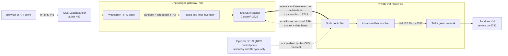

# Sparkbox on CoreWeave Kubernetes Service

This proof of concept splits Sparkbox across two trust domains: a non-root
public gateway and one capability-scoped Firecracker node pinned to a CKS
bare-metal CPU Node. A public CKS LoadBalancer provides SSH and wildcard HTTPS
routing under `coreweave.app`; the VM node has no public Service.

## What it creates

- Namespace `sparkbox-poc`.
- `sparkbox-gateway`, an unprivileged Deployment with no host devices,
  hostPath, Linux capabilities, or writable root filesystem.
- `sparkbox-node`, a Deployment pinned to one exact amd64 Node. Its application
  controller is non-root and capability-free; a narrow helper sidecar owns
  KVM/TUN and the remaining VM-launch capabilities.
- `sparkbox-device-plugin`, a capability-free DaemonSet that advertises one
  `sparkbox.dev/kvm`, `sparkbox.dev/tun`, and temporary `sparkbox.dev/loop`
  allocation per eligible Node.
- A Node-local XFS `hostPath` at `/mnt/local/sparkbox-poc` for the VM inventory,
  rootfs template, live sandbox disks, and node identity.
- A 100 GiB `shared-vast` PVC mounted at `/mnt/sparkbox-durable` for durable
  gateway databases, edge certificate cache, and checkpoint objects.
- Kubelet-managed device allocations for `/dev/kvm`, `/dev/net/tun`, and the
  loop-device bundle used by the one-shot trusted-template preparation init
  container. At runtime only the VMM helper receives KVM/TUN; the application
  controller receives no devices. There are no raw device `hostPath` volumes.
- A public `LoadBalancer` Service selecting only the gateway on ports 443 and
  22, plus an internal ClusterIP Service for the authenticated fleet link.
- Default-deny ingress, with only the gateway's SSH/fleet and HTTPS ports
  admitted. The node has no admitted ingress. A Cilium egress policy permits
  the VM node to reach only public IP space, cluster DNS, and the internal
  gateway fleet service.
- A Secret containing one operator's **public** SSH key.
- A separately provisioned `sparkbox-identity` Secret containing the stable
  gateway, OIDC, and node-control identity, mounted only by the gateway. The
  node receives a separate Secret containing only the gateway's public host-key
  pin and public upstream login key.

## Gateway-to-VM traffic

The split CKS deployment currently uses an outbound, host-key-pinned SSH link
set from the VM node to the gateway: one control connection plus independently
supervised data lanes. The node is started with `--node-control-transport ssh`;
it does not publish a gRPC control endpoint. When the gateway needs guest TCP
port 6743, it opens a `sandbox-stream@sparkbox` channel carrying the sandbox
name, stream kind `tcp`, and port `6743` on a dedicated authenticated data lane.
The node resolves the sandbox from its local inventory and dials the guest's
TAP address at `HostIP:6743`.



The earlier gRPC work is separate from this stream path. It moves inventory
and lifecycle control off SSH and can advertise authoritative guest addresses.
With `--guest-data-transport auto` or `routed` and a real route to the guest
subnet, the gateway can then dial a roster-approved guest IP directly; gRPC
itself never tunnels the application bytes. This CKS manifest enables neither
the node gRPC endpoint nor that routed guest network, so SSH remains its guest
data plane.

There is also a public-edge distinction. Sparkbox can preserve an arbitrary
original destination port when the host firewall funnels an any-port range to
its HTTPS listener, but the CKS LoadBalancer Service exposes only 22 and 443.
In this deployment, configure the sandbox's HTTPS route to target guest port
6743 and access it through public port 443. A direct
`https://<sandbox>.<domain>:6743` requires an additional LoadBalancer port or an
equivalent any-port funnel; merely listening on 6743 inside the VM does not
publish that port.

The Sparkbox controller runs as UID/GID 65532, drops every capability, receives
no devices, and uses `RuntimeDefault` seccomp/AppArmor. A separate root
`vmm-helper` container owns only the capabilities required for TAP/network
setup, chroot/device construction, file ownership, and terminating its per-VM
UID children. It is `privileged: false`, has no `CAP_SYS_ADMIN` or loop devices,
and exposes only a mode-0600 Unix socket authenticated with `SO_PEERCRED`. Its
path-free protocol accepts a validated VM name and network slot; paths,
executables, device numbers, and credentials are fixed at helper startup.
Firecracker runs in a per-VM chroot as `100000 + slot`, with an empty environment
and no capabilities. The one-shot preparation init container holds
`CAP_SYS_ADMIN` and the loop bundle only while patching the trusted base
template, then exits before guest work starts. The Pod does not use host PID,
network, IPC, or user namespaces. TAP devices, sysctls, NAT, and packet-filter
rules therefore live in the Pod's network namespace instead of modifying the
CKS Node's Cilium network namespace.

## Egress isolation and Sluice

CKS applies two independent egress boundaries to the VM node. The helper builds
stateful iptables chains inside the Pod network namespace before opening its
Unix socket. Each TAP is pinned to its slot-derived guest address, private and
non-global destinations are dropped, unsolicited forwarded traffic is dropped,
and a guest may initiate host traffic only to DNS and the authenticated metadata
service. The controller can still initiate SSH to a guest because established
reply traffic is admitted. Failure to install or verify these chains prevents
the helper from becoming ready.

After guest IPv4 traffic is masqueraded to the Pod address and leaves the Pod
veth, `vm-node-public-egress` supplies the outer Cilium boundary. Its positive
allow-list contains public IPv4/IPv6 space with private, loopback, link-local,
documentation, benchmark, multicast, and reserved ranges excluded. Separate
service-aware rules permit only CoreDNS on TCP/UDP 53 and
`sparkbox-gateway` on TCP 2222. This also prevents a compromised application
controller from using the Pod network to move laterally through the cluster or
CKS underlay.

The VM node also runs Sluice as a dedicated sidecar. It mounts only its Unix
control-socket `emptyDir`: it receives no KVM/TUN devices, VMM-helper socket,
guest disks, host path, or service-account token. It has a read-only root
filesystem and runs as UID 0 with only `CAP_BPF`, `CAP_NET_ADMIN`, and
`CAP_NET_BIND_SERVICE`, which are required to load and attach TCX programs and
bind DNS on port 53. The unprivileged Sparkbox controller waits for Sluice's
control API before starting, then uses that socket for per-tag policy and usage.
UID 0 is deliberate on CKS/containerd: a non-root UID receives the requested
capabilities only in its bounding set, with empty permitted/effective sets, so
the kernel rejects BPF map creation. A live probe verifies that the root process
loads the eBPF collection with exactly those three capabilities while retaining
`RuntimeDefault` seccomp and AppArmor.

The helper creates `172.30.0.53/32` on a Pod-local `sparkdns` dummy interface;
new guests receive that address as their resolver. Sluice binds only that
address, pins it in the eBPF allow-set, and runs with `--enforce`. Every VM is
therefore restricted to the minimal base image allow-list; a VM whose tags
carry a network rule also receives that rule's DNS answers. CKS deliberately
does not use Sluice's `--open-untagged` compatibility mode, because a newly
created TAP would otherwise be unrestricted until its first fleet policy push.

TAP startup is fail closed as well. The VMM helper creates the interface, then
calls Sluice's host-local readiness endpoint over the shared socket. Sluice
does an immediate reconciliation and acknowledges only after both TCX programs
are attached and the allow/enforcement maps are synchronized. The helper does
not launch Firecracker if that acknowledgement fails, so a guest cannot send
public traffic during tap discovery or a Sluice restart.

Packet processing is deliberately layered:

```text
guest -> sluice TC/eBPF allow-set (when tagged) -> TAP iptables ceiling
      -> IPv4 masquerade -> Cilium Pod egress policy -> public destination
```

With `--guest-dns 172.30.0.53`, a guest reaches Sluice's node-local TCP/UDP DNS
listener through the explicit host-DNS rule. Sluice narrows a tagged TAP to the
IPs learned from allowed DNS answers. Even if an answer contains an
RFC1918, link-local, or cluster address, the inner iptables ceiling still drops
it and the outer Cilium policy independently refuses it. Public-IP restrictions
therefore remain the responsibility of Sluice; the CKS controls are the
non-bypassable internal-network ceiling.

The base rules are baked from `deploy/sluice-allowlist.txt` into each immutable
runtime image. User-specific rules remain dynamic and are managed in the web
console by binding network rules to VM tags. Existing running VMs need a
pause/resume before they receive the new resolver kernel argument; newly booted
and resumed VMs use it automatically.

This manifest requires Cilium's `CiliumNetworkPolicy` CRD. `deploy.sh` applies
the policy before starting the gateway and VM node, so the node never comes up
with unrestricted Pod egress during an ordinary rollout.

Because CKS runs with `--disable-host-rootfs-mounts`, creating a reusable
template snapshot is currently refused. Pause/resume and archive/restore remain
available. Re-enable template snapshots only after fork identity sanitization
runs inside the guest or a disposable mountless helper.

The named host path survives deletion and replacement of the node Pod on the
same Node. It is still an ephemeral hot tier: CoreWeave local storage is lost
when the Node is replaced. The gateway database, identity Secret, and VAST
objects survive that loss; VM inventory and guest disks do not. Do not treat
this manifest as a production deployment.

When a legacy combined Deployment exists, `deploy.sh` stops it, copies its
SQLite databases and edge caches to VAST, and leaves `sandboxes.json` and VM
files on the pinned Node. On a clean split install, the migration is skipped;
the node-local directory and gateway databases are initialized in their new
locations. Before the VM node starts, the first init container removes any
retired gateway databases, edge TLS cache, and fleet private keys from the
hostPath; the second prepares the trusted base image and exits. The identity
Secret is a required precondition and remains the recovery source for the
gateway's keys.

The proposed path to durable identity and recoverable reflink-backed guest
disks is documented in
[`cks-reflink-persistence-plan.md`](cks-reflink-persistence-plan.md).

The released rootfs deliberately leaves out fast-moving agent CLIs. On every
Pod start, the Kubernetes bootstrap runs the same atomic template refresher as
other Sparkbox hosts. It installs current `claude`, `codex`, `pi`, and
`hivemind` binaries plus the guest workload-identity services before opening the
gateway. New sandboxes therefore have the complete agent toolchain without a
rootfs rebuild. Existing sandbox disks are not rewritten by a later refresh.

## Runtime image from GitHub Actions

`.github/workflows/sparkbox-cks-image.yml` builds this Containerfile for
`linux/amd64` and publishes it to GitHub Container Registry on every push that
changes Sparkbox or the workflow. It needs no registry secret: the workflow's
`GITHUB_TOKEN` receives `packages: write`.

Every build receives a traceable full-SHA tag and a branch tag. The default
branch also updates `edge`. Tags can still be moved, including the SHA tag, so
resolve the workflow result once and deploy the OCI index digest:

```sh
SHA=<the full commit SHA built by the successful workflow>
REPO=ghcr.io/vanpelt/sparkbox-cks
DIGEST=$(crane digest "$REPO:sha-$SHA")
IMAGE="$REPO@$DIGEST"
```

The digest is the immutable runtime image identity. The index includes the
linux/amd64 image plus its provenance attestation; pin the index digest rather
than copying the child image digest reported by one runtime. The agent CLI
versions remain intentionally fast-moving: the immutable image contains the
bootstrap logic, while the entrypoint resolves current Claude, Codex, Pi, and
HiveMind releases before patching a stale template.

GHCR packages are private until their visibility is changed. After the first
workflow run, open the `sparkbox-cks` package settings on GitHub and change its
visibility to public so CKS can pull it without an image-pull secret. The image
contains the current Sparkbox and Sluice binaries, the base Sluice allow-list,
host networking tools, and the template refresher. At Pod startup it downloads
and SHA-256-verifies the Firecracker,
kernel, and universal rootfs artifacts pinned to Sparkbox `v0.5.3`, then
downloads the current agent CLI bundles and patches the template. The first
start downloads the roughly 750 MB release payload plus those CLI bundles and
decompresses a sparse ext4 image. Later same-Node Pod starts reuse the cached
artifacts and template.

## Preserve the gateway identity

Sparkbox starts with `--key-dir=/run/sparkbox/keys --require-keys`. It never
silently creates a replacement identity in the local control directory. The
read-only `sparkbox-identity` Secret must contain:

```text
gateway_host_key.pem
gateway_upstream_key.pem
oidc_signing_key.pem
node_ca_cert.pem
node_ca_key.pem
gateway_control_key.pem
```

If OIDC key rotation is in progress, also include
`oidc_signing_key_prev.pem`. The other public keys are derived from their
private keys, and the renewable gateway control certificate is reissued from
the saved CA and gateway control key.

Before replacing the currently running, self-generated POC identity, capture it
directly from the sole running Sparkbox Pod:

```sh
deploy/kubernetes/capture-identity.sh
```

The helper auto-detects the original `/var/lib/sparkbox/state` layout and the
new `/var/lib/sparkbox/control` layout. It copies only the identity files
through a mode-`0700` temporary directory, validates that they look like PEM
keys/certificates, creates or updates `sparkbox-identity`, and removes the local
temporary copies. It prints filenames, never key material. Pass `--context`,
`--pod`, or `--source-dir` when auto-detection is ambiguous.

For a fresh namespace or disaster recovery, first apply `namespace.yaml`, then
create the same Secret from an escrowed directory without printing its data:

```sh
IDENTITY_DIR=/secure/path/sparkbox-identity
kubectl apply -f deploy/kubernetes/namespace.yaml
kubectl -n sparkbox-poc create secret generic sparkbox-identity \
  --from-file="gateway_host_key.pem=$IDENTITY_DIR/gateway_host_key.pem" \
  --from-file="gateway_upstream_key.pem=$IDENTITY_DIR/gateway_upstream_key.pem" \
  --from-file="oidc_signing_key.pem=$IDENTITY_DIR/oidc_signing_key.pem" \
  --from-file="node_ca_cert.pem=$IDENTITY_DIR/node_ca_cert.pem" \
  --from-file="node_ca_key.pem=$IDENTITY_DIR/node_ca_key.pem" \
  --from-file="gateway_control_key.pem=$IDENTITY_DIR/gateway_control_key.pem" \
  --dry-run=client -o yaml | kubectl apply -f -
```

Add `--from-file=oidc_signing_key_prev.pem=...` when that rollover key exists.
The deploy script refuses to proceed when the Secret or any required entry is
missing.

Kubernetes Secret persistence is independent of the selected compute Node, but
it is not an off-cluster backup. Keep an approved escrow copy, especially of
`oidc_signing_key.pem`: it also protects access to encrypted user secrets.

The `sparkbox-durable` claim is a 100 GiB ReadWriteMany `shared-vast` volume.
Gateway SQLite databases live under `/mnt/sparkbox-durable/gateway/control` and
checkpoint objects under `/mnt/sparkbox-durable/checkpoints`. Live Firecracker
disks and `sandboxes.json` remain on Node-local XFS; do not move them onto VAST.

## Manual durable checkpoints

The one-node checkpoint command is temporarily unavailable in the split
deployment: the gateway no longer has the VM disk, and the VM node deliberately
does not mount the durable control volume. Existing immutable checkpoint
objects are retained. Restoring this feature requires a fleet checkpoint RPC
or a narrow transfer helper; remounting the gateway PVC into the VM
node would undo the secret/state separation. A size-limited ephemeral
`emptyDir` occupies the node's configured checkpoint path only so the
read-only container can initialize it; it is not durable storage and receives
no gateway data.

The original combined-Pod deployment enabled this manual checkpoint path:

```sh
ssh -p 22 ctl@ssh.<domain> checkpoint <sandbox>
ssh -p 22 ctl@ssh.<domain> checkpoint restore <sandbox>
```

Checkpointing pauses the guest, removes managed secret values from its disk,
checks and compacts the filesystem, compresses it, and copies a new immutable
object to VAST. A previously running guest then cold-boots. This creates more
downtime than the eventual pause-and-reflink design, but keeps the first
durable implementation synchronous and easy to reason about.

Only the latest committed checkpoint is exposed through the control command.
A failed upload leaves the previous pointer in place. Restore downloads and
decompresses beside the live rootfs, then atomically replaces it; it does not
consume the VAST object. The operation is owner-scoped through the existing
`ctl@` authorization path.

This is not yet automated Node-loss recovery. The latest-checkpoint pointer is
still in the Node-local control record, and this slice has no schedule,
retention policy, manifest index, or content digest. Keep the control directory
when replacing only the Pod. After loss of the whole Node, the immutable VAST
objects remain, but recovering their sandbox metadata is still an operator
procedure and a later milestone.

## Deploy

Check the target before applying anything:

```sh
kubectl config current-context
kubectl get nodes \
  -o custom-columns=NAME:.metadata.name,POOL:.metadata.labels.compute\\.coreweave\\.com/node-pool,TYPE:.metadata.labels.node\\.coreweave\\.cloud/type
```

Then deploy, selecting the NodePool and the public key that should be the first
Sparkbox operator:

```sh
deploy/kubernetes/deploy.sh \
  --image "$IMAGE" \
  --node-pool default-node-pool \
  --public-key ~/.ssh/id_ed25519.pub \
  --user vanpelt
```

When the NodePool has exactly one ready, schedulable amd64 Node, the script
selects it automatically. If the pool has more than one eligible Node, choose
the hot tier's owner explicitly:

```sh
deploy/kubernetes/deploy.sh \
  --image "$IMAGE" \
  --node-pool default-node-pool \
  --node g084f44 \
  --public-key ~/.ssh/id_ed25519.pub \
  --user vanpelt
```

The script resolves the exact Node, verifies `sparkbox-identity`, derives a
public-only gateway host-key pin, and reads the LoadBalancer's `ExternalRecords`
domain. If a legacy combined Deployment exists, it stops it and runs the
idempotent state-migration Job; a clean split install skips that migration. It
then starts the device-plugin DaemonSet and waits for all three extended
resources, starts both role-specific Deployments, and uses the operator key to
approve the node's authenticated fleet enrollment. The public gateway is then
selected by the existing LoadBalancer and the ingress policies are applied.
Sparkbox's `autocert` provider obtains certificates on the HTTPS listener.

The wildcard record does not represent the base name itself. Use any label,
such as `ssh`, for the SSH gateway. The Kubernetes entrypoint passes this
public hostname and the load balancer's public ports to Sparkbox, so the login
page and WebAuthn origin never advertise the Pod's internal names or ports:

```sh
DOMAIN=$(
  kubectl -n sparkbox-poc get service sparkbox \
    -o=jsonpath='{.status.conditions[?(@.type=="ExternalRecords")].message}' |
  sed 's/^\\*\\.//'
)

ssh -p 22 ctl@"ssh.$DOMAIN" help
ssh -p 22 new@"ssh.$DOMAIN"
```

The browser dashboard is:

```text
https://my.<domain>
```

New sandboxes receive two vCPUs and 8 GiB RAM by default. This POC admits at
most two running sandboxes for one owner and limits the Pod to eight CPUs,
24 GiB RAM, and 100 GiB Kubernetes-accounted ephemeral storage. The host path
is not quota-enforced by Kubernetes; monitor and clean
`/mnt/local/sparkbox-poc` as part of operating the Node.

## Observe and troubleshoot

```sh
kubectl -n sparkbox-poc get pods,daemonset,service,pvc,networkpolicy
kubectl get node -o custom-columns='NAME:.metadata.name,KVM:.status.allocatable.sparkbox\.dev/kvm,TUN:.status.allocatable.sparkbox\.dev/tun,LOOP:.status.allocatable.sparkbox\.dev/loop'
kubectl -n sparkbox-poc logs daemonset/sparkbox-device-plugin
kubectl -n sparkbox-poc logs -f deployment/sparkbox-gateway
kubectl -n sparkbox-poc logs -f deployment/sparkbox-node
kubectl -n sparkbox-poc describe pod -l app.kubernetes.io/name=sparkbox
```

The startup probe allows 20 minutes because the rootfs is large. Common hard
failures are:

- The device plugin cannot see `/dev/kvm`, `/dev/net/tun`, `/dev/loop-control`,
  or the eight loop block devices on the selected Node.
- `sparkbox.dev/kvm`, `sparkbox.dev/tun`, or `sparkbox.dev/loop` does not become
  allocatable before the VM-node rollout.
- The selected Node is not ready, schedulable, amd64, and in the selected
  NodePool.
- `sparkbox-identity` is absent, incomplete, or contains invalid key material.
- The `sparkbox-durable` PVC cannot bind to `shared-vast`.
- GitHub release downloads are blocked.
- An agent CLI release endpoint is unavailable.
- The mounted local filesystem cannot perform reflink copies.
- The cluster or organization has no public LoadBalancer/IP quota.

The certificate cache and control databases are on VAST; guest disks and VM
inventory remain Node-local. Private identity comes from the gateway-only
Kubernetes Secret. The VM node identity is fixed at `cks-poc`, rather than
inheriting the changing Kubernetes Pod name, so placement records remain stable
across rollouts. A node Deployment pinned to a lost Node remains pending until
it is redeployed for a replacement Node. Automated checkpoint creation,
checkpoint discovery, and automatic recovery remain work described in
[`cks-reflink-persistence-plan.md`](cks-reflink-persistence-plan.md).

## Remove the POC

Deleting the namespace removes the Service, public address, Pod, identity
Secret, and PVC claim:

```sh
kubectl delete namespace sparkbox-poc
```

Kubernetes does not remove the `hostPath`. Before releasing or repurposing the
Node, separately remove `/mnt/local/sparkbox-poc` through an authorized Node
maintenance workflow. A Node reboot also makes that encrypted local data
unrecoverable. The current `shared-vast` StorageClass uses a `Retain` reclaim
policy, so deleting the claim may leave its backing volume for separate
operator recovery or cleanup; verify that state before assuming either deletion
or recovery. Restore `sparkbox-identity` from escrow after namespace loss.
